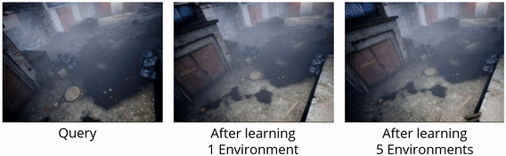

# AirLoop

This repo contains the source code for paper:

[Dasong Gao](http://theairlab.org/team/dasongg/), [Chen Wang](https://chenwang.site), [Sebastian Scherer](http://theairlab.org/team/sebastian/). "[AirLoop: Lifelong Loop Closure Detection](https://arxiv.org/pdf/2109.08975)." International Conference on Robotics and Automation (ICRA), 2022.

<p align="center">
  <a href="https://youtu.be/Gr9i5ONNmz0">
    
  </a>
</p>

## Demo

Examples of loop closure detection on each dataset. Note that our model is able to handle cross-environment loop closure detection despite only trained in individual environments sequentially:
<p align="center">
  
</p>

Improved loop closure detection on TartanAir after extended training:
<p align="center">
  
</p>

## Usage
### Dependencies

 - Python >= 3.5
 - PyTorch < 1.8
 - OpenCV >= 3.4
 - NumPy >= 1.19
 - Matplotlib
 - ConfigArgParse
 - PyYAML
 - tqdm

### Data
We used the following subsets of datasets in our expriments:
 - [TartanAir](https://theairlab.org/tartanair-dataset/)
   - Train/Test: `abandonedfactory_night`, `carwelding`, `neighborhood`, `office2`, `westerndesert`;
 - [RobotCar](https://robotcar-dataset.robots.ox.ac.uk/)
   - Train: `2014-11-28-12-07-13`, `2014-12-10-18-10-50`, `2014-12-16-09-14-09`; 
   - Test: `2014-06-24-14-47-45`, `2014-12-05-15-42-07`, `2014-12-16-18-44-24`;
 - [Nordland](https://webdiis.unizar.es/~jmfacil/pr-nordland/)
   - Train/Test: All four seasons with recommended splits.

The datasets are aranged as follows:
```
$DATASET_ROOT/
├── tartanair/
│   ├── abandonedfactory_night/
│   └── ...
├── robotcar/
│   ├── train/
│   │   ├── 2014-11-28-12-07-13/
│   │   └── ...
│   └── test/
│       ├── 2014-06-24-14-47-45/
│       └── ...
└── nordland/
    ├── train/
    │   ├── fall_images_train/
    │   └── ...
    └── test/
        ├── fall_images_test/
        └── ...
```

### Configuration
The following values in [`config/config.yaml`](config/config.yaml) need to be set:
 - `dataset-root`: The parent directory to all datasets (`$DATASET_ROOT` above);
 - `catalog-dir`: An (initially empty) directory for caching processed dataset index;
 - `eval-gt-dir`: An (initially empty) directory for groundtruth produced during evaluation.

### Commandline
The following command will train a model sequentially (except for `joint`) in the specified envronments and evaluate the performance:

```sh
$ python main.py --dataset <tartanair/robotcar/nordland> --out-dir <OUT_DIR> --envs <LIST_OF_ENVIRONMENTS> --epochs <LIST_OF_EPOCHS> --method <finetune/si/ewc/kd/rkd/mas/rmas/airloop/joint>
```

`--skip-train` and `--skip-eval` can be specified to skip the train/test phase.
